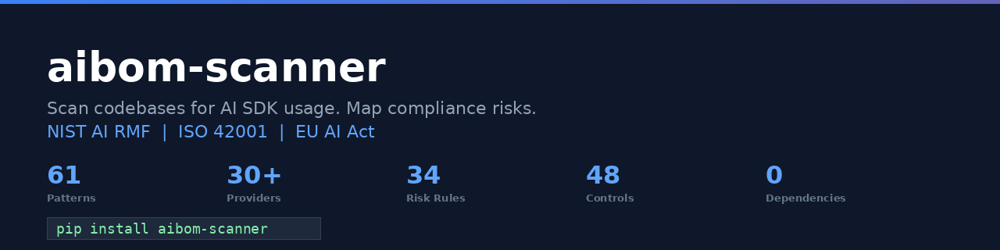
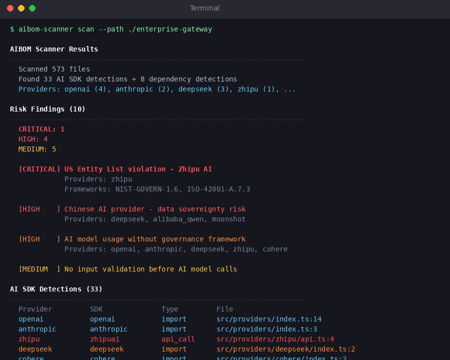

<p align="center">
  
</p>

<p align="center">
  <strong>Scan codebases for AI SDK usage. Map compliance risks to NIST AI RMF, ISO 42001, and EU AI Act.</strong>
</p>

<p align="center">
  <a href="https://pypi.org/project/aibom-scanner/"></a>
  <a href="https://opensource.org/licenses/Apache-2.0"></a>
  <a href="https://www.python.org/downloads/"></a>
  <a href="https://github.com/saasvista/aibom-scanner/actions"></a>
  <a href="https://github.com/saasvista/aibom-scanner"></a>
</p>

---

## Quick Start

```bash
pip install aibom-scanner

aibom-scanner scan --path /path/to/your/repo
```

<p align="center">
  
</p>

## What It Finds

`aibom-scanner` detects AI SDKs in your codebase and generates an **AI Bill of Materials (AIBOM)** with compliance risk findings mapped to three frameworks.

| | |
|---|---|
| **61 detection patterns** | OpenAI, Anthropic, Google AI, AWS Bedrock, Cohere, Mistral, Groq, HuggingFace, and 22 more |
| **10 Chinese AI providers** | 3 BIS Entity-Listed (Zhipu, iFlytek, SenseTime = CRITICAL), 7 data sovereignty flagged |
| **Agentic AI detection** | CrewAI, AutoGen, LangGraph, Semantic Kernel, MCP |
| **34 risk rules** | 8 categories with evidence-qualified severity adjustment |
| **48 compliance controls** | NIST AI RMF (23), ISO 42001 (15), EU AI Act (10) |
| **Secrets detection** | Hardcoded API keys, Vault, AWS Secrets Manager, dotenv |
| **Dev tool detection** | Cursor, GitHub Copilot, Claude Code, Aider, TabNine |
| **Zero dependencies** | Pure Python stdlib. Nothing to install but Python. |

## Output Formats

```bash
# Table output (default in terminal)
aibom-scanner scan --path . --format table

# JSON (default when piped)
aibom-scanner scan --path . --format json > aibom.json

# SARIF for GitHub Code Scanning
aibom-scanner scan --path . --format sarif > results.sarif

# Fail CI on high/critical findings
aibom-scanner scan --path . --severity-threshold high
```

## GitHub Action

Add AI compliance scanning to every PR:

```yaml
# .github/workflows/aibom-scan.yml
name: AIBOM Scan
on: [push, pull_request]
jobs:
  scan:
    runs-on: ubuntu-latest
    steps:
      - uses: actions/checkout@v4
      - uses: saasvista/aibom-scanner@v1
        with:
          severity-threshold: high
```

## AI Providers Detected

| Category | Providers |
|----------|-----------|
| **Major** | OpenAI, Anthropic, Google AI, AWS Bedrock, Azure OpenAI, Cohere, Mistral, Groq |
| **Open Source** | HuggingFace, Together AI, Fireworks, Replicate |
| **Chinese (BIS Entity List)** | Zhipu AI, iFlytek, SenseTime |
| **Chinese (Data Sovereignty)** | DeepSeek, Alibaba Qwen, Baidu ERNIE, Moonshot, MiniMax, Baichuan, Yi |
| **Agentic** | CrewAI, AutoGen, LangGraph, Semantic Kernel |
| **Protocol** | MCP (Model Context Protocol) |
| **Orchestration** | LangChain, LlamaIndex |

## Risk Categories

| Category | Rules | Examples |
|----------|:-----:|---------|
| Data Privacy | 4 | Missing DPA, data classification, prompt retention |
| Model Governance | 8 | No inventory, no versioning, supply chain risk |
| Security | 4 | Hardcoded keys, no input/output validation |
| Transparency | 3 | No AI disclosure, no decision logging |
| Accountability | 3 | No risk owner, no incident response plan |
| Bias & Fairness | 2 | No bias testing, no fairness evaluation |
| Export Compliance | 4 | BIS Entity List, data sovereignty, EU AI Act |
| Agentic AI | 5 | No HITL, no access controls, no observability |

## Compliance Frameworks

| Framework | Controls | Coverage |
|-----------|:--------:|----------|
| **NIST AI RMF** | 23 | GOVERN, MAP, MEASURE, MANAGE functions |
| **ISO 42001** | 15 | AI management system requirements |
| **EU AI Act** | 10 | Articles 5-52, high-risk classification |

## How It Works

```
Your Codebase
     │
     ▼
┌─────────────┐     ┌──────────────┐     ┌─────────────┐     ┌────────────────┐
│ File Walker  │────▶│  AI SDK      │────▶│ Risk Engine │────▶│ Control Mapper │
│ git ls-files │     │  Detector    │     │ 34 rules    │     │ 48 controls    │
│ os.walk      │     │  61 patterns │     │ 8 categories│     │ 3 frameworks   │
└─────────────┘     └──────────────┘     └─────────────┘     └────────────────┘
                           │                    │                     │
                    Detections +          Risk findings         Gap analysis
                    model names +         with severity         NIST / ISO /
                    dependencies          qualification         EU AI Act
                                                                     │
                                                                     ▼
                                                              Table / JSON / SARIF
```

## Why This Exists

We scanned 5 popular open-source AI repos (470K combined GitHub stars):

- **389** AI SDK detections
- **116** compliance findings
- **0** governance controls fully mapped

One enterprise security company had a **BIS Entity-Listed Chinese AI provider** inherited silently through an acquisition.

EU AI Act enforcement starts **August 2026**. If you don't know what AI SDKs are in your codebase, you can't govern them.

## Contributing

Contributions welcome. See [CONTRIBUTING.md](CONTRIBUTING.md) for guidelines.

- **Add detection patterns** — new AI providers, SDKs, or frameworks
- **Improve risk rules** — better severity calibration, new categories
- **New output formats** — CycloneDX, SPDX, HTML reports
- **Language support** — Go, Rust, Java detection improvements

## License

Apache-2.0. See [LICENSE](LICENSE).

---

<p align="center">
  Built by <a href="https://saasvista.io">SaaSVista</a> — AI Risk & Compliance Copilot
</p>
